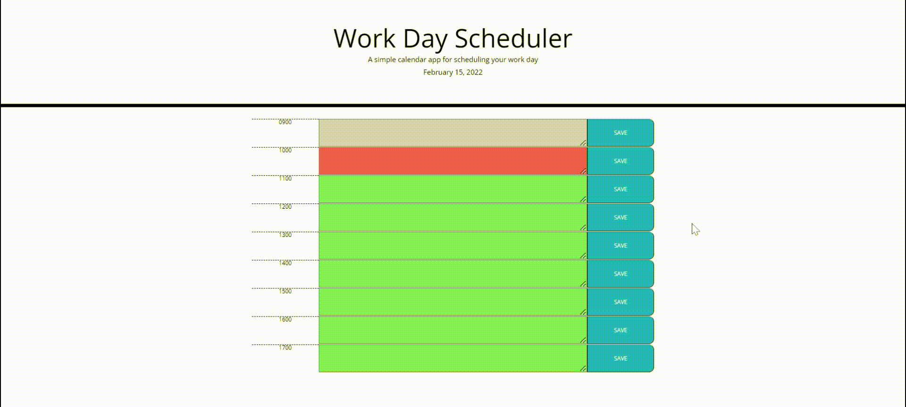

# Workday-Scheduler

## Deployed URL

## Workday-Scheduler
A simple calendar application allowing for the saving of events spread across the typical business day (0900 - 1700).

Moment.js provides the Date and Time upon page loading.

Information within the scheduler is easily saved to local storage with the click of the save button. 

Local storage items are displayed upon page load.

## Demonstration

